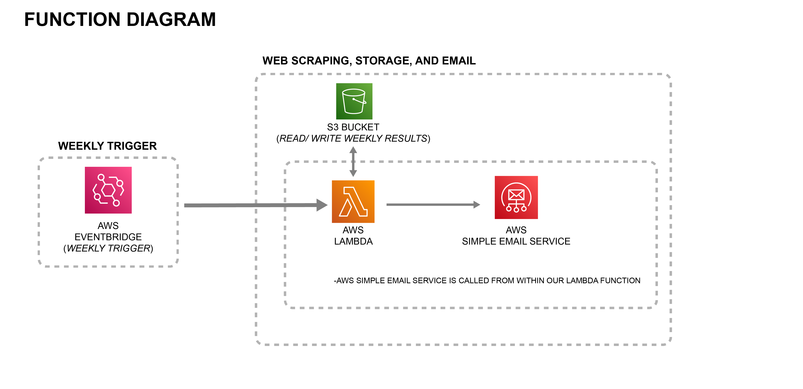

# Weekend Update
Example repo to demonstrate how a containerized [AWS Lambda](https://aws.amazon.com/lambda/) function and [AWS Simple Email Service (SES)](https://aws.amazon.com/ses/) can be used to scrape web information, and compile and send an HTML-formatted email
### Intent
* AWS [has very thorough documentation](https://docs.aws.amazon.com/) on how to get started using a Lambda function with a container - The goal of this repo isn't to duplicate those efforts.
<br><br>
* Rather, the purpose of this repo is to offer resources and tips to get started with Selenium and Chrome in a containerized Lambda function, through some samples from a real application.
<br><br>
* [Selenium](https://www.selenium.dev/) and [Chrome](https://www.selenium.dev/documentation/webdriver/getting_started/install_drivers/) compatibility issues can be notoriously difficult to troubleshoot, making a container deployment compelling because it can streamline debugging, development, and deployment by using a common container environment.
## Primary Use Case
Quickly collect, process, and email important information from multiple sources on a weekly basis.

## Technologies Used

|                      Technology Used                      |     Badge     | Purpose                                                                                                                                                                                                  |
|:---------------------------------------------------------:|:-------------:|:---------------------------------------------------------------------------------------------------------------------------------------------------------------------------------------------------------|
|    [Amazon Web Service (AWS)](https://aws.amazon.com/)    |          | Used to run [AWS Lambda](https://aws.amazon.com/lambda/) to execute our serverless function, and [AWS Simple Email Service (SES)](https://aws.amazon.com/ses/) to send an email from our Lambda function |
|             [Docker](https://www.docker.com/)             |          | Containerization platform used with AWS to simplify debugging, versioning issues, and deploying a Python script that uses Selenium and Chrome                                                            |
|             [Python](https://www.python.org/)             |           | Primary programming language used in this example                                                                                                                                                        |
| [HTML](https://developer.mozilla.org/en-US/docs/Web/HTML) |           | Secondary programming language used with CSS to format the email update                                                                                                                                  |
|  [CSS](https://developer.mozilla.org/en-US/docs/Web/CSS)  |           | Secondary programming language used with HTML to format the email update                                                                                                                                 |
|           [Selenium](https://www.selenium.dev/)           |           | Used with Python to automate web browsing and scraping                                                                                                                                                   |
|        [Google Chrome](https://www.selenium.dev/documentation/webdriver/getting_started/install_drivers/)         |           | Web browser used with Selenium in a headless state to automate web browsing                                                                                                                              |
|            [Gmail](https://gmail.google.com/)             |           | Email client used to send mail with AWS Simple Email Service (SES) - While Gmail is used for this example, other email clients can be used                                                               |

## Concept Diagram
Below is a diagram that graphically shows the concept and AWS services used:



In a text form, the use-case with this application is to: 
1. Use Amazon Event Bridge to trigger a Lambda function to run on a weekly basis
<br><br>
2. The Lambda function will scrape a set of websites, and collect and format content from those web pages
<br><br>
4. and send that content through AWS Simple Email Service (SES)
<br>

****
## For Advanced Users
Some more concise notes are below to help get started:

<details>
<summary>Show More</summary>

### Docker Image
Below is a link to a repo containing a docker file that works well with Lambda, and includes Selenium and Chrome for easy web scraping:<br><br>
**[https://github.com/umihico/docker-selenium-lambda](https://github.com/umihico/docker-selenium-lambda)** <br><br>
There is also a copy of the Docker file from above within this repo, but it may not be as current as the repo linked above.
### Simple Email Service (SES) Sample
</details>
<br>

****
## For Newer Users
A more thorough guide is posted below, which should help to jump-start development:


<details>
<summary> Show More </summary>


## Setting up your Development Environment
This sample targets a deployment using Python, but other languages and IDEs can be used (Refer to the AWS documentation for more).

| Step                                                                                                                                               | Comments                                                                                                                                                                                                                                                                                  |
|:---------------------------------------------------------------------------------------------------------------------------------------------------|:------------------------------------------------------------------------------------------------------------------------------------------------------------------------------------------------------------------------------------------------------------------------------------------|
| 1. Set up an account on [Amazon Web Service (AWS)](https://aws.amazon.com/), if you don't have one already                                         | Be sure to follow the [best practices](https://docs.aws.amazon.com/accounts/latest/reference/best-practices.html) from AWS when settting up your account                                                                                                                                  |
| 2. Install [Docker](https://docs.docker.com/get-docker/), if you don't have it installed already                                                   | Docker is a prerequisite only for testing your application locally and for building deployment packages using the --use-container option. If you don't plan to use these features initially, you can skip this section or install Docker at a later time.                                                                                                                                 |
| 3. Install [AWS CLI (Command Line Interface)](aws.amazon.com/cli) and the [AWS SAM (Serverless Architecture Model)](aws.amazon.com/serverless/sam) | A helpful guide for getting set up with PyCharm from AWS can be found [here](https://docs.aws.amazon.com/toolkit-for-jetbrains/latest/userguide/welcome.html), and a similar guide from JetBrains can be found [here](https://www.jetbrains.com/pycharm/guide/tutorials/intro-aws/setup/) |
| 4. Install PyCharm and the [AWS Toolkit](https://aws.amazon.com/pycharm/)                                                                          | AWS integrates with other IDEs if you prefer an alternative                                                                                                                                                                                                                               |
## Creating a sample application to get started
This [link](https://docs.aws.amazon.com/serverless-application-model/latest/developerguide/serverless-getting-started-hello-world.html) to the AWS documentation provides a robust guide to get started with a sample application.

To get started from a blank template, you can run the terminal command below:
```
sam init
```
Be sure to select the correct language (in this case, Python is being shown), and for a container application, choose "container" instead of "zip" for the application type.

For the purposes of this demo, specific focus is called to the files listed in **ALL CAPS** below:
```
 sam-app/
   ├── readme.md
   ├── events/
   │   └── event.json
   ├── hello_world/
   │   ├── __init__.py
   │   ├── APP.PY            #YOU WILL WANT TO MODIFY THIS TO YOUR NEEDS
   │   └── REQUIREMENTS.TXT  #YOU MAY HAVE TO MODIFY FROM THE DEFAULT - SEE BELOW
   │   └── DOCKERFILE        #NOT INCLUDED IN THE TEMPLATE BY DEFAULT - SEE BELOW
   ├── TEMPLATE.yaml         #YOU MAY HAVE TO MODIFY FROM THE DEFAULT - SEE BELOW
   └── tests/
       └── unit/
           ├── __init__.py
           └── test_handler.py
```
| File             | Comments                                                                                                                                                                                                                                                                                     |
|:-----------------|:---------------------------------------------------------------------------------------------------------------------------------------------------------------------------------------------------------------------------------------------------------------------------------------------|
| app.py           | This code contains your base functionality for your lambda function. <br><br>Refer to this link to get started with Selenium and Python, if you are unfamiliar. <br><br> Refer to the sample code in this repo for an example on sending an email with SMTP (Simple Mail Transfer Protocol). |
| requirements.txt | This code helps to make sure that Python has the correct dependencies. Refer to the sample file in this repo for more information.                                                                                                                                                           |
| Dockerfile       | This Dockerfile is a copy from the source Repo at this link. <br> <br> While a sample Dockerfile is included in this repo, please check the source repo linked above to make sure that the latest version is being used.                                                                     |
| template.yaml    | This file will provision your resources on AWS, when you build your application with the AWS SAM CLI tool. <br><br> As mentioned above, you may have to modify this base .yaml file to suit your specific application needs.                                                                 |

</details>


# Reference Diagrams:
<details>
<summary>Show More</summary>

## Function Diagram

The Diagram below graphically explains the general concept behind using PyCharm, AWS Serverless Architecture Model (SAM), and Docker to develop and publish a containerized Lambda function.


</details>


